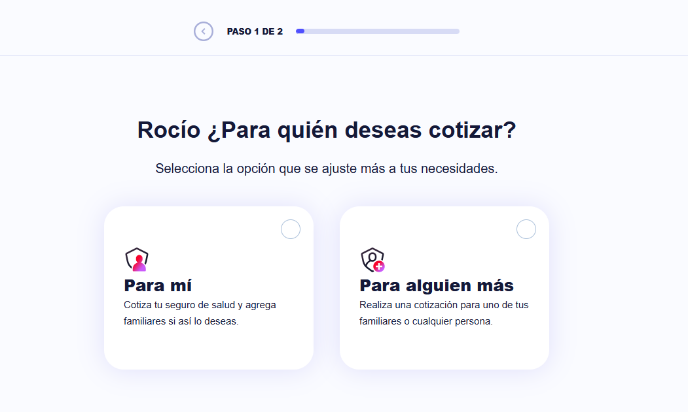
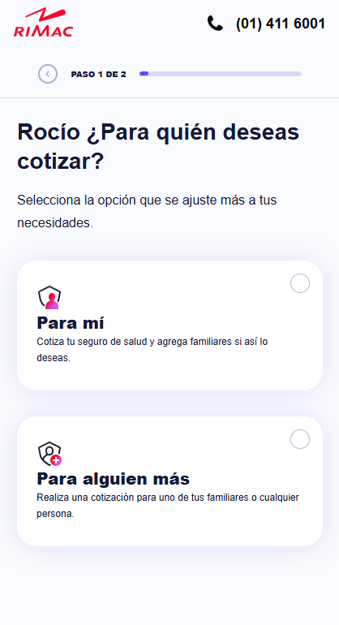

# App de Selección de Seguros


Una aplicación web moderna desarrollada para RIMAC Seguros que permite a los usuarios cotizar y gestionar planes de seguros de salud de manera eficiente y personalizada. La plataforma ofrece una experiencia de usuario fluida y profesional, implementando las mejores prácticas de desarrollo y diseño UI/UX.

## 🌟 Demo

[Ver Demo en Vercel](https://reto-frontend-pi.vercel.app/)

## 🎨 Diseño

El diseño de la aplicación está disponible en [Figma](https://www.figma.com/design/KGftIKxhcVm41kTKMsfTh2/Frontend-Challenge-2023?node-id=6994-137449&p=f&t=8QvxQi1AtxXKX9LI-0)

## 🎯 Características

- 📚 Validación de formularios
- 📱 Experiencia responsive optimizada para móviles y escritorio
- 🎯 Cotización personalizada basada en edad y necesidades
- 💰 Comparación intuitiva de planes y beneficios
- 📋 Formularios con validación en tiempo real
- 🔄 Gestión de estado eficiente con Zustand
- 🎨 Diseño moderno y accesible siguiendo los lineamientos de RIMAC

### Objetivos del Proyecto

- Desarrollar una interfaz moderna y accesible
- Implementar una arquitectura escalable y mantenible
- Garantizar una experiencia de usuario fluida y sin fricciones
- Optimizar el rendimiento y tiempo de carga
- Mantener altos estándares de calidad de código

## 🚀 Tecnologías Utilizadas


## 📸 Capturas de Pantalla

### Vista de Escritorio



### Vista Móvil



## 📁 Estructura del Proyecto

```
src/
├── assets/         # Imágenes y archivos estáticos
├── components/     # Componentes UI reutilizables
├── constants/      # Constantes de la aplicación
├── pages/         # Componentes de páginas principales
├── services/      # Servicios de API
├── store/         # Gestión de estado
├── styles/        # Estilos SCSS
└── types/         # Definiciones de TypeScript
```

## API Reference

En esta parte se muestra los servicios utilizados para el.

#### Obtener usuario

```http
  GET /api/user.json
```

| Parameter  | Type     | Description   |
| :--------- | :------- | :------------ |
| `name`     | `string` | **Required**. |
| `lastName` | `string` | **Required**. |
| `birthDay` | `string` | **Required**. |

#### Obtener planes

```http
  GET /api/plans.json
```

| Parameter     | Type     | Description   |
| :------------ | :------- | :------------ |
| `name`        | `string` | **Required**. |
| `price`       | `number` | **Required**. |
| `description` | `string` | **Required**. |
| `age`         | `number` | **Required**. |

## 🛠️ Instalación y Configuración

1. Clonar el repositorio

```bash
git clone https://github.com/AlexRojasCoaquira/reto-frontend.git
```

2. Instalar dependencias

```bash
pnpm install
```

3. Iniciar servidor de desarrollo

```bash
pnpm dev
```

## 📦 Construcción

Generar una construcción para producción:

```bash
pnpm build
```

## 🧪 Testing

Ejecutar los tests:

```bash
pnpm test
```

## 🔍 Linting y Formateo

Ejecutar el linter:

```bash
pnpm lint
```

Formatear el código:

```bash
pnpm format
```

## Variables de entorno

Crea un archivo `.env` en la raíz del proyecto con las siguientes variables:

```bash
VITE_API_RIMAC=<tu_url_api>
```

## 🚀 CI/CD

El proyecto utiliza GitHub Actions para:

- 🔍 Linting y verificación de tipos
- 🧪 Ejecución de tests
- 📦 Build y deploy automático a Vercel
